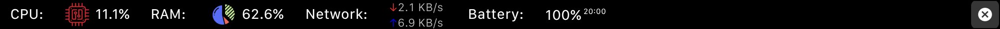

# AS's Configuration

## Main Bar

- Brightness & Volume Bar
- Special characters Bar
- Apps Bar
- Dock Bar
- Performance Bar
- Music Bar
- Screenshot
- Delete
- Save
- Logoff

## Brightness & Volume Bar

- Brightness -
- Brightness +
- Volume
- Mute
- Mute microphone

## Special characters Bar

_This is really useful for french keyboard layout_

- Numbers from 0 to 9
- some special characters

## Apps Bar

- Dock
- Finder
- VS Code
- Outlook
- Arc browser

## Dock Bar

- All docked apps, but not the same order

## Performance Bar

- CPU
- RAM
- Network
- Battery percentage and remaining time

## Music Bar

- previous
- play/pause
- next
- music played
