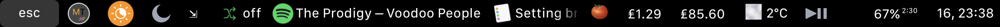
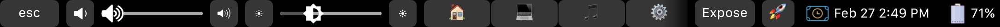
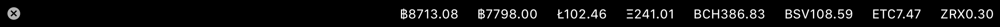
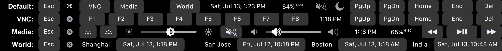
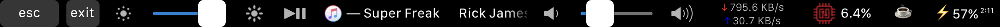

# My TouchBar My Rules Presets
Here we collect cool touch bar presets for [MTMR](https://github.com/toxblh/mtmr). Feel free to send your own configs in pull-requests. Do not forget to attach a screenshot (⇧⌘6) and write some description to this README.

---

[@ReDetection preset](ReDetection/ReDetection.json)

[@Toxblh preset](Toxblh/toxblh.json)

Widgets:
- NightShift, DnD, Reminders, Pomodoro, Currencies, Weather, Play, Input, Battery, Time (tap for sleep)

Customs:
- Show video in PiP (for Safari only)
- iTunes like the track
- iTunes favorite the track
- iTunes what is play, tap for next and long for prev track
- Spotify shuffle
- Spotify what is play, tap for next

[@luongvo209 preset](luongvo209/luongvo209.json)

[@aadi_vs_anand preset](aadi_vs_anand/aadi_vs_anand.json)

[@Frityet](Frityet/items.json)

[ML-Present](ML-Present/ML-Present.json)

[spaniakos](spaniakos/spaniakosPreset.json)
- Thanks to the above presets spaniakos preset is an all in one preset solution with different bars embeded into one master.
- Main: Escape, native touchbar, running apps, Spotify with two-finger volume and three finger brightness control, Media/$$/Info sub bars, language change, battery%, sleep, time (only time 24H format), 
- Media bar: Brightness, mute, volume control, spotify control.
- Crypt bar Various Crypto values preset, Some are in $ and some in €
- Info: weather info, CPU, disk, Network meter, DnD (Do not Disturb), Day/Night mode, Countdown timer (tomato) , language selection , battery % date with day, month , time (12H format), AM/PM

[@darkomen78](darkomen78/slg.json)

- Battery, CPU, Network, (reserved for disk activity), Music Prev, Music Play/Pause, Music Next, Music Track, Sound volume down, Sound slide, Sound volume up, Input language, Screensaver

Only two custom things here (and an icon for the battery) :
- CPU button is more based on what you can see in Activity Monitor. You must copy the AppleScript file [cpu.scpt](darkomen78/cpu.scpt) to the folder : /Users/Shared/MTMR/
- The last button "power lock", simply start the screensaver (and lock the current session). I prefer that than a full sleep or a sleep display.
Now, i'm seeking for a disk real-time activity button.

[@megatops preset](megatops/MTMR.json)

> The brightness and volume slider icons are from @Frityet preset.

[@mrcsmxms preset](mrcsmxms/items.json)

Widgets:
- Escape, ExitMTMR, Brightness, PlayButton (iTunes), Volume, network, CPU-Load, sleep, battery

**Default**

* <kbd>Esc</kbd> key
* Back to system Touch Bar
* Expand `VNC` sub group
* Expand `Media` sub group
* Expand `World` sub group
* Local date & time
* Battery usage
* Mute/Unmute
* DND (Do Not Disturb); long press to sleep
* <kbd>PgUP</kbd> / <kbd>PgDn</kbd> keys
* <kbd>Home</kbd> / <kbd>End</kbd> keys: Send MacOS <kbd>⌘</kbd> + <kbd>←</kbd> or <kbd>⌘</kbd> + <kbd>→</kbd> events; long press to send key code.
* <kbd>Del</kbd> key

**VNC**

* <kbd>Esc</kbd> key
* Back to default layout
* <kbd>F1</kbd> ~ <kbd>F8</kbd> keys
* Local time; long press to sleep
* <kbd>PgUP</kbd> / <kbd>PgDn</kbd> keys
* <kbd>Home</kbd> / <kbd>End</kbd> keys: Send key code; long press to send MacOS <kbd>⌘</kbd> + <kbd>←</kbd> or <kbd>⌘</kbd> + <kbd>→</kbd> events.

  > :warning: Different with the default behavior. This behavior is optimized for remote control Windows/Linux systems.

* <kbd>Del</kbd> key

**Media**

* <kbd>Esc</kbd> key
* Back to default layout
* Keyboard illumination down/up
* Screen brightness down
* Screen brightness slider
* Screen brightness up
* Mute/Unmute
* Volume down
* Volume slider
* Volume up
* Local time; long press to sleep
* Battery usage
* Previous track
* Play/Pause
* Next track

**World**

* <kbd>Esc</kbd> key
* Back to default layout
* Shanghai data & time
* Other countries/cities

[@bobrosoft preset](bobrosoft/bobrosoft.json)

- It's minimalistic and low CPU preset
- Thanks to the above presets for inspiration and @darkomen78 for cpu.scpt which I reused here
- Create /Users/Shared/MTMR/ folder and drop there spotify.scpt from [here](bobrosoft/)
- If your main music player is not Spotify, you can get some scripts inspiration from [here](aadi_vs_anand/aadi_vs_anand.json) for example

**Features**

- Click on music player string stops/resumes current track, long click brings up Spotify window
- You can see some random Emojis there, just for fun :)
- Click on Weather opens up weather site, currently Yandex.Weather (you can change to yours)
- CPU meter changes color based on load. Click on CPU usage opens up Activity Monitor
- Click on currency (EUR/RUB pair) opens up business website, currently rbc.ru (you can change to yours)
- NightShift button
- No brightness or volume buttons there because you can use built-in two/three-finger slide gestures on bar for that

[@docceri preset](docceri/docceriPreset.json)

Main:
- esc key
- crypto menu (see below)
- keyboard light intensity - and +
- weekday, date and time (12H)
- volume controls
- current weather (create your own API, instructions are on the main page)
- charge level (FYI: if you are not charging the battery, it shows how many hours you can use the computer on battery)
- "x" - for exiting the preset
- del key

Crypto menu:
- BTC to USD
- ETH to USD
- BCH to USD
- XLM to USD
- LTC to USD
- EOS to USD

If you click any of the crypto prices, this will redirect you to the corresponding currency's cryptowat.ch chart.
