# My TouchBar My Rules Presets

Here we collect cool touch bar presets for [MTMR](https://github.com/toxblh/mtmr). Feel free to send your own configs in pull-requests. Do not forget to attach a screenshot (⇧⌘6) and write some description to this README.

---

[@ReDetection preset](ReDetection/ReDetection.json)

---

[@Pythonicninja preset](pythonicninja/pythonicninja.json)
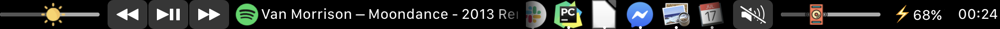

---

[@Toxblh preset](Toxblh/toxblh.json)

Widgets:
- NightShift, DnD, Reminders, Pomodoro, Currencies, Weather, Play, Input, Battery, Time (tap for sleep)

Customs:
- Show video in PiP (for Safari only)
- iTunes like the track
- iTunes favorite the track
- iTunes what is play, tap for next and long for prev track
- Spotify shuffle
- Spotify what is play, tap for next

---

[@luongvo209 preset](luongvo209/luongvo209.json)

---

[@aadi_vs_anand preset](aadi_vs_anand/aadi_vs_anand.json)

---

[@Frityet](Frityet/items.json)

---

[ML-Present](ML-Present/ML-Present.json)

---

[spaniakos](spaniakos/spaniakosPreset.json)
- Thanks to the above presets spaniakos preset is an all in one preset solution with different bars embeded into one master.
- Main: Escape, native touchbar, running apps, Spotify with two-finger volume and three finger brightness control, Media/$$/Info sub bars, language change, battery%, sleep, time (only time 24H format),
- Media bar: Brightness, mute, volume control, spotify control.
- Crypt bar Various Crypto values preset, Some are in $ and some in €
- Info: weather info, CPU, disk, Network meter, DnD (Do not Disturb), Day/Night mode, Countdown timer (tomato) , language selection , battery % date with day, month , time (12H format), AM/PM

---

[@darkomen78](darkomen78/slg.json)

- Battery, CPU, Network, (reserved for disk activity), Music Prev, Music Play/Pause, Music Next, Music Track, Sound volume down, Sound slide, Sound volume up, Input language, Screensaver

Only two custom things here (and an icon for the battery) :
- CPU button is more based on what you can see in Activity Monitor. You must copy the AppleScript file [cpu.scpt](darkomen78/cpu.scpt) to the folder : /Users/Shared/MTMR/
- The last button "power lock", simply start the screensaver (and lock the current session). I prefer that than a full sleep or a sleep display.
Now, i'm seeking for a disk real-time activity button.

---

[@DanDolog Yandex Music Preset](YandexMusicPreset/items.json)

Widgets:
- Telegram, Google Translator, Music Controls, Yandex Music, Currency (RUB to USD), Yandex Weather, CPU, Battery and invisible "Exit MTMR" button 

Instructions about Yandex Music and Telegram:
- Download [Yandex Music Unofficial](https://yandex-music.juvs.dev) and Telegram client
- Right-click the Dock icon of this Apps, then select Options and choose All Desktops in the submenu
- Tap them on the touchbar and enjoy!

---

[@megatops preset](megatops/MTMR.json)

> The brightness and volume slider icons are from @Frityet preset.

**Default**

* <kbd>Esc</kbd> key
* Back to system Touch Bar
* Expand `VNC` sub group
* Expand `Media` sub group
* Expand `World` sub group
* Local date & time
* Battery usage
* Mute/Unmute
* DND (Do Not Disturb); long press to sleep
* <kbd>PgUP</kbd> / <kbd>PgDn</kbd> keys
* <kbd>Home</kbd> / <kbd>End</kbd> keys: Send MacOS <kbd>⌘</kbd> + <kbd>←</kbd> or <kbd>⌘</kbd> + <kbd>→</kbd> events; long press to send key code.
* <kbd>Del</kbd> key

**VNC**

* <kbd>Esc</kbd> key
* Back to default layout
* <kbd>F1</kbd> ~ <kbd>F8</kbd> keys
* Local time; long press to sleep
* <kbd>PgUP</kbd> / <kbd>PgDn</kbd> keys
* <kbd>Home</kbd> / <kbd>End</kbd> keys: Send key code; long press to send MacOS <kbd>⌘</kbd> + <kbd>←</kbd> or <kbd>⌘</kbd> + <kbd>→</kbd> events.

  > :warning: Different with the default behavior. This behavior is optimized for remote control Windows/Linux systems.

* <kbd>Del</kbd> key

**Media**

* <kbd>Esc</kbd> key
* Back to default layout
* Keyboard illumination down/up
* Screen brightness down
* Screen brightness slider
* Screen brightness up
* Mute/Unmute
* Volume down
* Volume slider
* Volume up
* Local time; long press to sleep
* Battery usage
* Previous track
* Play/Pause
* Next track

**World**

* <kbd>Esc</kbd> key
* Back to default layout
* Shanghai data & time
* Other countries/cities

---

[@bobrosoft preset](bobrosoft/bobrosoft.json)

- It's minimalistic and low CPU preset
- Thanks to the above presets for inspiration and @darkomen78 for cpu.scpt which I reused here
- Create /Users/Shared/MTMR/ folder and drop there spotify.scpt from [here](bobrosoft/)
- If your main music player is not Spotify, you can get some scripts inspiration from [here](aadi_vs_anand/aadi_vs_anand.json) for example

**Features**

- Click on music player string stops/resumes current track, long click brings up Spotify window
- You can see some random Emojis there, just for fun :)
- Click on Weather opens up weather site, currently Yandex.Weather (you can change to yours)
- CPU meter changes color based on load. Click on CPU usage opens up Activity Monitor
- Click on currency (EUR/RUB pair) opens up business website, currently rbc.ru (you can change to yours)
- NightShift button
- No brightness or volume buttons there because you can use built-in two/three-finger slide gestures on bar for that

---

[@docceri preset](docceri/docceriPreset.json)

Main:
- esc key
- crypto menu (see below)
- keyboard light intensity - and +
- weekday, date and time (12H)
- volume controls
- current weather (create your own API, instructions are on the main page)
- charge level (FYI: if you are not charging the battery, it shows how many hours you can use the computer on battery)
- "x" - for exiting the preset
- del key

Crypto menu:
- BTC to USD
- ETH to USD
- BCH to USD
- XLM to USD
- LTC to USD
- EOS to USD

If you click any of the crypto prices, this will redirect you to the corresponding currency's cryptowat.ch chart.

---

[@mrcsmxms preset](mrcsmxms/items.json)

Widgets:
- Escape, ExitMTMR, Brightness, PlayButton (iTunes), Volume, network, CPU-Load, sleep, battery

---

[@KoenvGinkel preset](pinkelPreset/items.json)

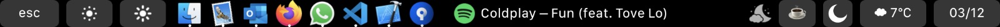
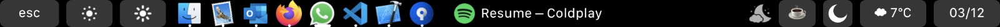

Features:
- When paused there is a resume button integrated in the line.
- When playing there is a pause button integrated in the line.

---

[@metasean preset](metasean/items.json) &
[randomQuotes script](metasean/randomQuotes.sh)

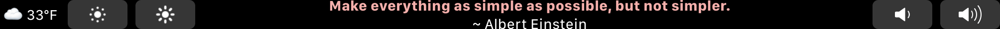
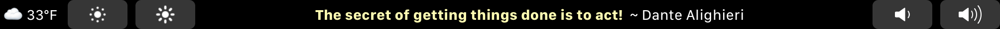
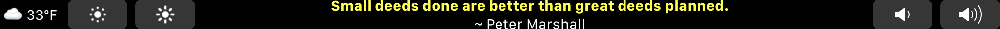
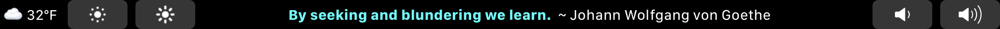
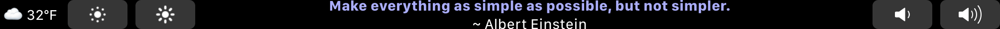
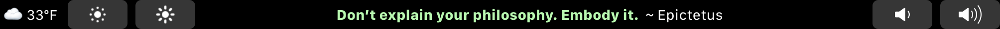
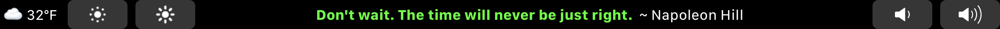
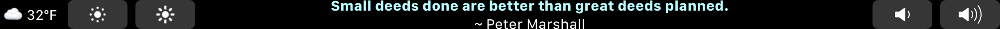
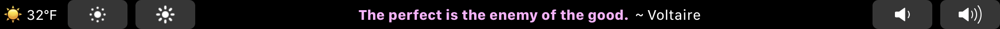
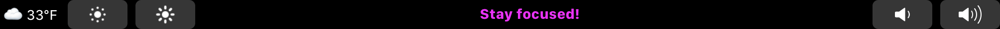
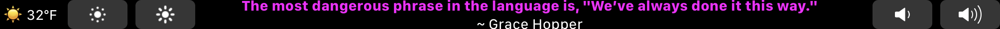
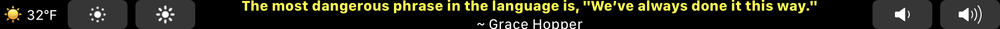
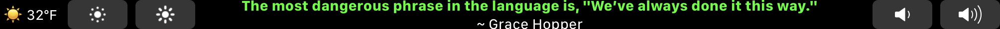

Widgets:
- Weather, brightnessDown, brightnessUp, random quote display, (single quote display), volumeDown, volumeUp, sleep

Includes a shellScriptTitledButton filePath script to generate a random quote in a random foreground color, as well as an example of an inline script to display a single specific quote.

---

[@luchesigui preset](luchesigui/luchesigui.json)

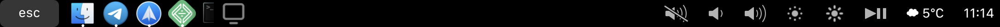

Left:
- esc key
- doc
- show desktop (apple script)
- spotify

Right:
- Mute
- Vol Down
- Vol Up
- Bright Down
- Bright Up
- Play/Pause
- Wheather (30 min update)
- Time in my native country

---

[@retroplasma preset](retroplasma/retroplasma_invisible.json)

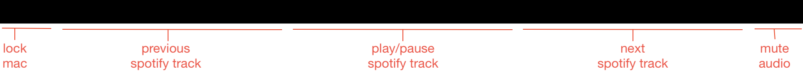

- invisible touch bar for less distraction when watching videos etc.
- small button on the left: lock mac
- three big buttons in the center for spotify: previous, play/pause, next
- small button on the right: mute audio
- enable gestures for brightness/volume

---

[@ohheyjosh](ohheyjosh/ohheyjosh.json)

- Music bar occupies most of left side
- Local date and time centered by right buttons
- Empty button to help with centering
- Brightness toggle buttons
- Volume mute and slider
- Colored lock/screensaver button

---

[@utkini preset](utkini/items.json)
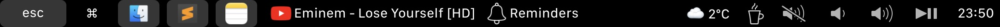

Left:
- Esc key
- Exit MTMR
- Finder (home path)
- Sublime text
- Note

Center:
- YouTube playing (safari)
- VK music playing (safari)
- Reminders. Show a random incomplete reminder

Right:
- Weather
- Lock Screen
- Vol mute
- Vol down
- Vol up
- Play/pause
- Time

---

[@trumad plexWidget](./trumad/items.json)

Pay attention to these variables at the start of the apple script which you'll need to personalise for this to work:

set plexUrl to "YOUR.PLEX.URL.OR.IP.COM"
(Your plex URL - domain/IP only, no https:// or port etc)

set plexToken to "YOUR_PLEX_TOKEN"
(https://support.plex.tv/articles/204059436-finding-an-authentication-token-x-plex-token/)

set playerName to "PLAYER_ID_FOR_COMPUTER_MTMR_IS_USED_ON"
(It's important to set a player name so that the currently displayed music is that which is playing on your touchbar mac, not some other device. The player name can be found by visiting http://YOUR_PLEX_URL:32400/status/sessions?X-Plex-Token=YOUR_PLEX_TOKEN in a browser while music is playing. In the "<Player" section of the XML output, look for a "title" attribute which shows the name Plex is giving your computer. Alternatively, in Plex settings view Authorised devices and copy the name from the top of the relevant entry)

Touching the plex display on your touch screen will focus the Plex Media Player app, if you're using it. If you're using plex in a browser, maybe consider installing the app instead.

Hopefully someone finds this useful. If there are any bugs or improvement that can be made to my apple script or anything, please let me know!

---

[@zwb124 preset](./zwb124/zwb124.json)

### Widgets
- Exit, Esc, Eject, Music, Weather, Battery, Pomodoro, DateTime, volumeDown, volumeUp, Mute, Screenshot

### Customs
- Eject: eject all external drivers and notifications
- Music: Show app icon, show the singer and song name that is playing, click Pause or resume, long and hold the next song
- Battery: Long press and hold show Activity Monitor
- DateTime: Show full date time，Press and hold Show Calendar app
- Screenshot: Click the Show screenshot, press and tap direct full screen screenshot.

---

[@AlexHg preset](./AlexHg/AlexHg.json)

### Home
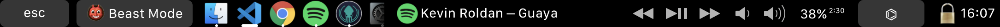
- Esc
- **Beast (Dev) Mode**
- App Dock, Spotify
- Music Control
- Volume Control
- Battery
- **Usefull Options**
- Time & Block Mac

### Beast Mode

- Close mode
- VSC activator
- Git Kraken activator
- Workbench activator
- Hyper Term activator
- Jira Atlassian open in chrome
- Jenkins open in chrome
- AWS Console open in chrome

- New window of active App
- Select multiple coincidence on VSC (CMD + D shortcut)
- Comment selected lines (CMD + shift + 7 shortcut)
- Search -> click: search on file (CMD + F shortcut); hold: search on complete project (CMD + shift + F shortcut)
- Run command VSC -> click: search by file name and complete posibilities (CMD + P shortcut); hold: run command (CMD + shift + P shortcut)
- console VSC -> click: Toggle console (CMD + key 33 shortcut); hold: new console (CMD + shift + key 33 shortcut)

### Usefull Options

- esc
- kill current app
- illumination controls
- bightness controls with slide
- Volume controls with slide
- Tab Navigator for multitab Apps (ex. Chrome, VSC)
- Current App Setting Shortcut
- Full screen (hold) then at full screen click for 'super' full screen (tested on Chrome only)
- CPU %
- close mode

---

[@Prashant_Kesharwani preset](./Prashant_Kesharwani/items.json)

---

[@de1ayer preset](./de1ayer/MTMR.json)

> inspired by @megatops preset

---

[@donaldzou preset](./donaldzou/items.json)

**Main**

Left
- ese key
- Brightness down
- Brightness Up
- Mute
- Sound down
- Sound up

Right
- Music
- Whether
- Time
- Battery
- Sleep

**Music Key**

- Will show **Tap here to play music** if "Music" is not running, you can tap it and it will open music and start playing
- **Tap** Pause or play song if Music is running
- **Long Tap** Next song if Music is running
------------------

- If **Chrome/Safari/Opera** is running and a Youtube Video is playing
  - Will show the name of the video
  - **Tap** Pause or play the video
  - **Long Tap** Next video

**Battery Button**

- **Long Tap** Bring laptop to screensaver mode

**Moon Button**
- **Long Tap** Bring laptop to sleep

---

[@prateek3255 preset](./prateek3255/items.json)

- Cool icons for exitting the TouchBar, volume and brightness slider.
- Play/Pause songs in spotify by tapping the spotify item.

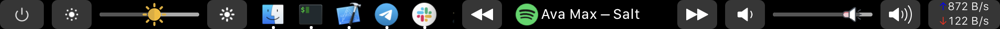

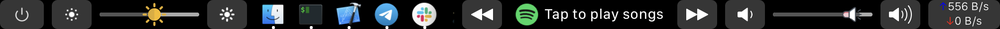

---

[@BitYoungjae preset](./BitYoungjae/items.json)

Decorated with a **simple** look.

### Detail

**Touch All**

**Touch Display**

**Touch Volume**

---

### FunctionBar by *e-simpson*

[@e-simpson's "FunctionBar" preset](./e-simpson/FunctionBar.json)

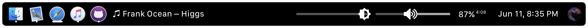

| Left Aligned                                                 | Right Aligned                                                |
| ------------------------------------------------------------ | ------------------------------------------------------------ |
| 1. Dock 2. Apple Music info (if playing or paused)   - Tap to pause/unpause    - ♫ denotes playing, ❙ ❙ denotes paused    - Hold to skip track  | 1. Brightness and volume sliders  2. Battery percent  3. Date  4. Profile Picture (must be manually imported) |

### YouTube Music Oriented

[preset](./mukmyash/items.json)

---

[@Alsastre](./Alsastre/items.json)

From left to right:

1. Dock without Spotify
2. Spotify icon
   1. Long press: Next song
   2. Press Play/Pause
3. Weather. See https://github.com/Toxblh/MTMR#weather
4. Do not disturbe
5. Batery %
6. Date
   1. Long Press: Lock computer
7. Exit MTMR

---

[@edoardoo preset](edoardoo/items.json)
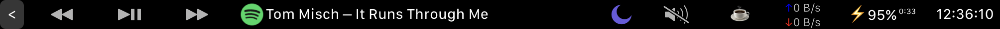

Use gestures for volume and brightness (2 and 3 fingers slide on the touchbar)

Buttons are widely spaced to avoid mistap.

Widgets:
- ExitMTMR, MediaKeys, Spotify (tap to open), DoNotDisturb, Mute,Lock, Network, Battery, time (HH:mm:ss)

---

[@munchikin preset](munchikin/items.json)

Widgets :
- lock, Bright control, Memo, VSCode, launchpad, mute, volume contrl, music control, battery, CPU monitoring

---

[@lolapatch](./Lola/Lola.json)

Main :
- Settings
- Numbers
- Launchpad
- Mute
- Dock (open apps)
- Airdrop (when finder open)
- Hide window (cmd + W)
- Quit  (cmd + Q)
- Save  (cmd + S)
- Delete (cmd + delete)
- Empty trash
- Screen Capture
- PU
- Quit Touch Bar

Settings :
- Close
- Brightness
- Sound
- Mute
- Keyboard brightness down
- Keyboard Brightness up
- Close
- Quit Touch Bar

- Numbers
- Open calculator
- Close

---

[@anmull](./anmull/items.json)

VPN indicator, copy/paste ISO-8601 datetime, retrieve additional weather info, custom Do Not Disturb, and more.

See [README](./anmull/README.md) for details on using the configuration and what is on each row.

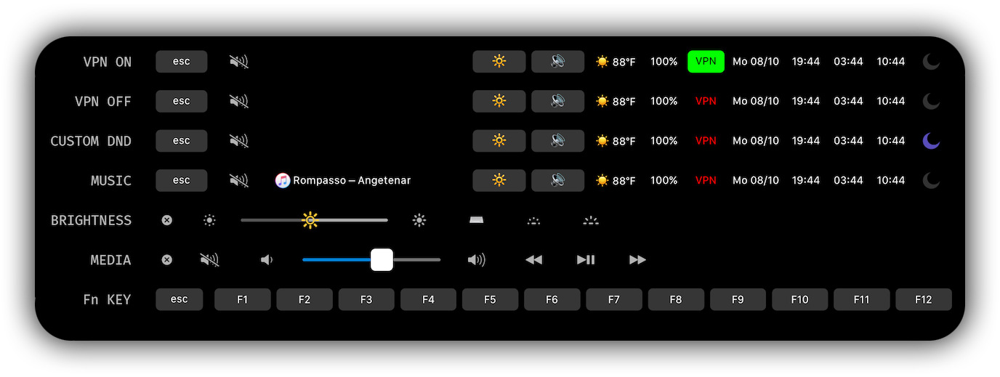

---

[@adorow preset](./adorow/items.json)

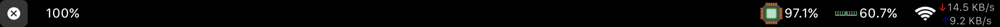

---

[@AccessRetrieved preset](AccessRetrieved/AccessRetrieved_code.json)

Features:
- <kbd>esc</kbd>
- Dock
- Music
- Prev., Next, Play/Pause
- Kill app
- Brightness control
- Keyboard illumination
- Mute/lower vol./louder vol.
- Memory uasge
- Poromodo
- Input source
- Screenshot
- Darkmode
- Presets: Dock, World time, and Media
- Simple welcome screen
- Safari website shortcuts
- Account name and prof. picture
- Weather
- Battery and remaining time
- Time
- Exit MTMR

Main Screen widgets:
- <kbd>esc</kbd>, Dock, Music, Controls, Safari, Profile Picture and Account name, weather, battery, time, exit mtmr

---

[@r12habh preset](./r12habh/item.json)

#### Youtube Music with time status

#### Youtube Music without time status

#### Spotify

#### Media and other buttons

### Issues
- Uses too much CPU which results in heating

### To Do
- Add on click play/pause for YouTube Music
- Add on long click next track for YouTube Music
- Find a way to run Spotify and YouTube Music together but only one showing in the TouchBar.

---

[@sw0rl0k preset](sw0rl0k/item.json)

Features:
- Control Strip (emulated default)
- Notion
- Telegram
- Firefox
- VS Code
- Pomodoro
- Mute button
- Play button
- Weather
- Time

Control Strip:

---

[@egerix preset](egerix/items.json)

Main panel:

Settings panel with "ExitMTMR" button:

---

[@Aldiskatel preset](Aldiskatel/items.json)
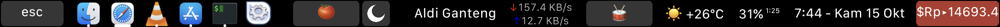

---

[@RenaldiPranata preset](RenaldiPranata/items.json)

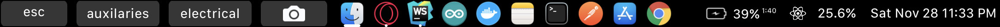

Widgets:
- Battery, Time

Customs:
- Show media in auxilaries group
- Show smarthome controller in electrical group
- Integrate smart device with ifttt

---

[@Cuterdio preset](Cuterdio/Cuterdio_items.json)
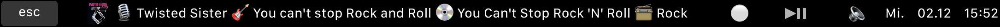

Widgets:
- Song information with cover art for [Cuterdio - Internet Radio](https://cuterdio.com)
- Close MTMR via tap on time
- Mic-Mute with toggle emoji
- Play-Pause
- Speaker-Mute with toggle emoji

---

[@minimalistic preset](minimalistic/minimalistic.json)

**Copy Folder mtmr to ~/Pictures so look like ~/Pictures/mtmr**

### Features:
- Custom Esc
- Show Label
- Battery in Percent
- CPU Usage in Percent
- Ram Usage in Percent
- Free Space Storage
- Weather
- Custom Date and Clock
- Sleep shorcut
- Swipe two finger to adjust Volume
- Swipe three finger to adjust Brightness

---

[@Functional Touchbar Preset](lnugraha/item.json)

Both WiFi and Bluetooth are **OFF**

Both WiFi and Bluetooth are **ON**

### Features:
- Reduce brightness
  - Press option (⌥) and brightness to quickly go to System Preferences and deactivate/activate True Tone Display
- Increase brightness
- Reduce keyboard backlit
- Increase keyboard backlit
- Eject all disks
- WiFi On/Off
  - Single tap to activate WiFi
  - Double tap to deactivate WiFi
  - Triple tap or long press to go to Network Settings in System Preferences
- Bluetooth On/Off
  - Make sure that you have installed blueutil (brew cask blueutil) to enable this feature
  - Long press to go to Bluetooth Connectivity in System Preferences
- Decrease volume
- Increase volume
- Mute
- Date and time
  - Long press to sleep your MacBook
- Exit MTMR

### WishLists
- Single tap to activate or deactivate WiFi
- A better icon for Wifi signals

---

[minimal preset](minimal/items.json)

**Main menu:**

**Alternative menu (after pressing ••• in main menu):**

---

[@deethereal](deethereal_preset/)  
**This preset consists of 2 touchbars:**  
[**first touchbar**](https://github.com/deethereal/MTMR-presets/blob/master/deethereal_preset/items1.json)  
* Network Speed
* Spotify current track
* decrease/increase brightness
*  buttons to switch to the previous/next track in your playlist
*  "coffee break"-button (turns off your display)
*  mute button
*  volume control
*  current battery status
*  system time  

[**second touchbar**](https://github.com/deethereal/MTMR-presets/blob/master/deethereal_preset/items2.json)  
* CPU load
*  Network Speed
*  brightness conttrol
*  do not disturb switcher
*  "coffee break"-button (turns off your display)
*  mute button, volume control
*  current battery status
*  system date|time  

---

[@Aarons preset](AaronsPreset/AaronsPreset.json)

**Main:**

**DEV group:**

The DEV group can be used to start programs used for developing purposes (I might add some stuff there). One could also use it for shortcuts (I prefer to use the Clion and PyCharm native touchbar instead of MTMR)

**SONOS group:**

The SONOS group leverages the [Menu Bar Controller for Sonos](https://mbc-for-sonos.app) to control the volume of my SONOS speakers.

---

[@SonyMiner preset](SonyMiner)
2021-05-13: Made som changes Moved main bar groups to the right so they are easier to access from the right hand. Also moved to the right all the sub-groups. Also replaced text in the groups for icons.

Main TouchBar - ESC, Dock, Battery, Weather, Wind Speed locations Group, Date and Time,  Apps direct access, Media group, Time group, Currency group, Web group

Weather and Wind Groups. By clicking yo go the website of your choice for weather or wind. Here examples

Media Group - Sound, music and brightness controls

Time Group - with timer and world time

Currency and Crypto Group - Some coins and currencies

Web bookmarks Group

Sub-Web bookmarks Group example

---

[@kocierik preset](kocierik/kocierik.json)

---

[@zhaoruheng preset](zhaoruheng/zhaoruheng.json)
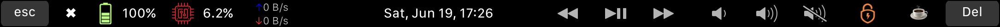

- Esc,ExitMTMR,Battery, CPU, Network, Time, Music Prev, Music Play/Pause, Music Next,, Sound volume down,, Sound volume up,Sound slide, Screensaver,Sleep,Delete

---

[@lensonyuan preset](lensonyuan/items.json)
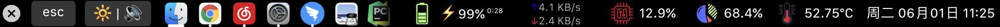

Widgets:
- CPU utilization, Memory utilization，CPU temperature, network,  Battery, Data time, etc..

features:
- Use stats command to display CPU temperature.
- The usage of CPU and memory is consistent with the data in the activity monitor of Apple system.
- cpu utilization use the top command info.
- memory utilization use the ps command info.
- Real time network speed display

---

[@wonz_preset](Wonz/items.json)

Features:

- Quit Touch Bar
- CPU
- Disk
- Network meter
- Spotify
- displaySleep
- volumeDown/Up
- mute
- battery
- weather
- timeButton

---

[@bruneitor preset](bruneitor/bruneitor_items.json)

Productivity touchbar

Features:
- Kill Apps
- Battery percentage
- Weather (Cº)
- CPU Usage
- Internet Connection
- Dock with open apps
- Screen Brightness
- Keyboard Brightness
- Music Controls
- Mute Control
- Do not disturb

---

[@Gavinin preset](Gavinin/items.json)

Features:

​	The main function is ClashX switcher (compatible ClashX Pro)

- Esc
- ClashX on/off
- Pause

---

[@Adm preset](Adm/adm_crypto_preset.json)

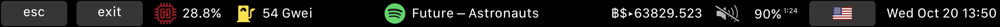

Crypto Productivity touchbar

Features:
- ESC button
- EXIT touchbar preset
- CPU utilization
- Ethereum Gas Tracker via ethscan (NEEDS API KEY) - just change the "API_KEY" url argument
- Spotify/Apple Music with play/pause on touch and SKIP on long touch
- BTC/USD price
- Mute
- Battery indicator
- Keyboard input change
- Date

---

[@tmshchk preset](tmshchk/tmshchk.json)

## Preview

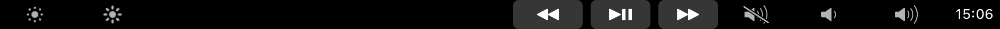

## Minimal TouchBar

- Brightness Down & Up
- Previous & Next Track
- Play/Stop
- Mute
- Volume Up & Down
- Clock
