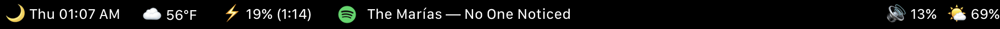

# Waterbongo Touchbar

A extremely simple, yet sophiscated touchbar, filled with custom scripts.

The left, shows the Day, and time. Along with a emoji to display time of day.

Next, we have the weather, just a default widget.

Then, we have the battery, which shows the battery percentage, and the emoji of the battery.

- Bonus for this one is that when you click on it, It will switch from low power to high power mode. when its in ⚡ its low power, and when its in 🔋 its high power.

And then of course, just media

second to last, we have the volume, which shows the volume percentage, and the emoji of the volume.

And last but not least, we have the brightness, which shows the brightness percentage, and the emoji of the brightness (changes with what brightness you use).

Change the brightness and volume by swiping with two/three fingers on the touchbar.
