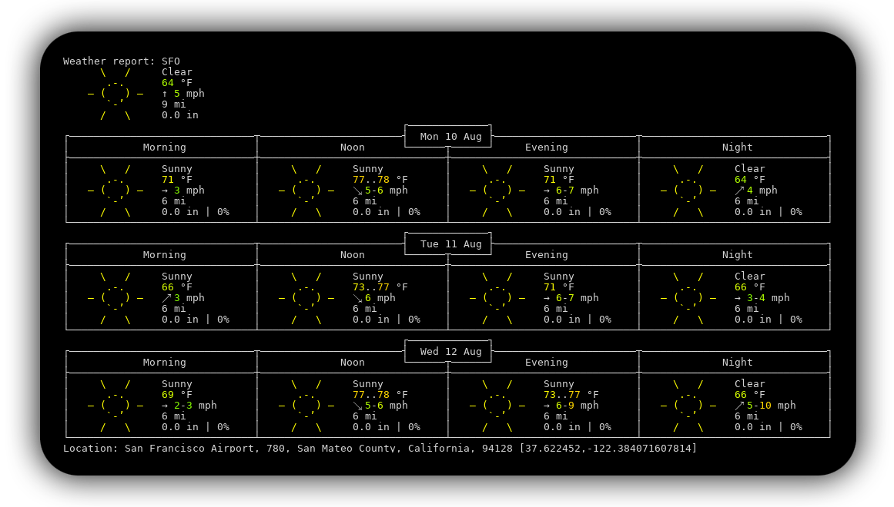

# anmull's Configuration

Bluetooth icon made by <a href="https://www.flaticon.com/authors/roundicons" title="Roundicons">Roundicons</a> from <a href="https://www.flaticon.com/" title="Flaticon">www.flaticon.com</a>

 Left to Right

### Line 1 
   - Escape
   - Mute
   - Brightness (keyboard and screen)
   - Media (volume, play/pause, next/prev)
   - Weather
      - Tap to fetch weather from wttr.in and open the image. (see below)
   - Battery
   - VPN not connected
   - Day and date.
      - Tap opens Calendar.app
   - Time in US/Pacific
      - Tap copies ISO-8601 date time to clipboard and pastes it at cursor
   - Time in Europe/London
      - Tap copies ISO-8601 date time to clipboard and pastes it at cursor
   - Time in Asia/Hong_Kong
      - Tap copies ISO-8601 date time to clipboard and pastes it at cursor
   - Bluetooth on
      - Tap toggles bluetooth state.
   - Custom DND
      - MTMR's DND does not properly disable DND so I made my own until that is fixed. Uses 'defaults' to determine state.

### Line 2
  - Same as Line 1, but Bluetooth is off

### Line 3
  - VPN is connected

### Line 4
  - Same as Line 3, but VPN is not connected

### Line 5
  - Do Not Disturb is on

### Line 6
  - Music is playing

### Line 7
  - Function keys shown by pressing fn key.

### Line 8
  - Decrease Screen Brightness
  - Brightness Slider
  - Increase Screen Brightness
  - Keyboard Preferences Pane
  - Decrease Keyboard Brightness
  - Increase Keyboard Brightness

### Line 9
  - Mute
  - Decrease Volume
  - Volume Slider
  - Increase Volume
  - Previous
  - Play/Pause
  - Next

## Installation

Bluetooth button requires `blueutil`, which can be installed with `brew install blueutil`.

VPN check is done using the `mtmr_vpncheck` script. You can either place the script in your `$PATH` or change the config to point to their absolute path. VPN checks will vary between VPN providers. Check the utun[0-9] interface that is active when your VPN is connected.

Update the weather config to use your own API key and update the city in `actionAppleScript`.

For Do Not Disturb to work, you must set the keyboard shortcut to `Shift-Ctrl-Opt-Cmd-D` or change the shortcut in `items.json`.

## Weather

The weather from wttr.in is for made for consoles, but it's simple to grab an image of and display, which is why I picked it.

