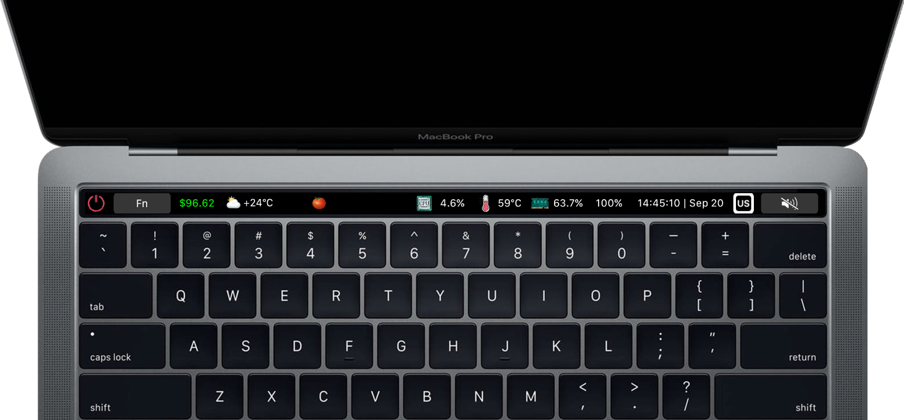

[simplest](simplest/items.json)

# `Default`
- `Quit MTMR`.
- Expand `Fn` sub group.
- `Currency`. Tap to open url.
- `YandexWeather`. Tap to open url.
- `Pomodoro`. Tap to start timer for 30 min. Long-press to start timer for 5 min.
- `CPU usage`. Tap to open Activity Monitor.
- `CPU temperature`. Tap to open Activity Monitor.
- `RAM usage`. Tap to open Activity Monitor.
- `Battery`. Tap to open batery preference.
- `Time`. Tap to open app Clock. Long-press  to open app Calendar.
- `Inputsource`. Tap to switch language.
- `Volume Mute`.

# `Fn`
- Back to Default bar
- `F1` - `F12`
- `PgUp`, `PgDn`, `Del`

# [Gestures](https://github.com/Toxblh/MTMR#gestures)
By default you can enable basic gestures from application menu (status bar -> MTMR icon -> Volume/Brightness gestures):

- Two finger slide: change you Volume
- Three finger slide: change you Brightness

